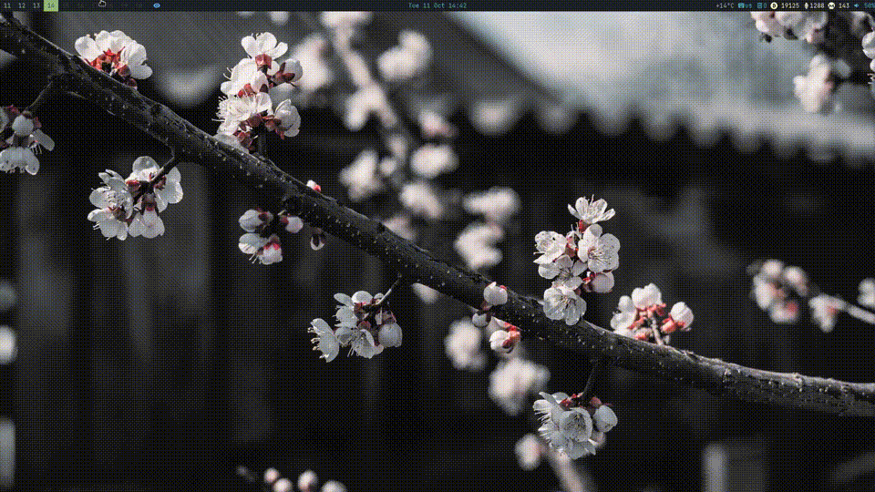
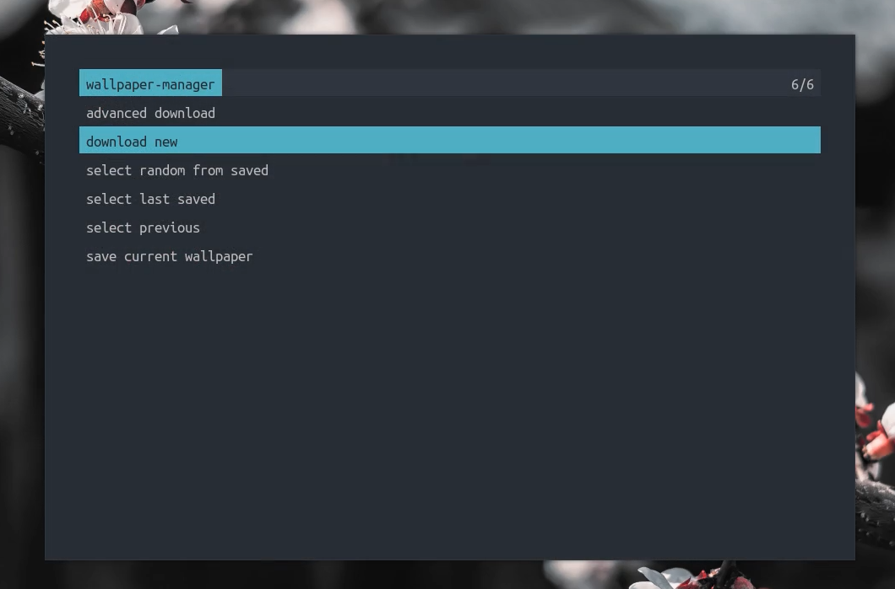
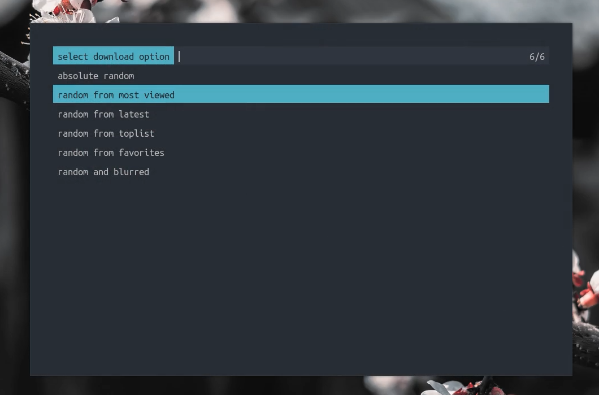
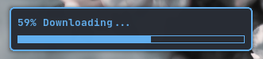
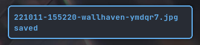
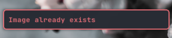

# Rofi wallpaper manager

Rofi wallpaper manager allowing you to automatically download, save and change
the wallpaper in 4k


| Rofi-wallpaper-manager                  |
|-----------------------------------------|
|  |

| Main interface                       | Advance download                        |
|--------------------------------------|-----------------------------------------|
|  |  |

#### Notices:
| Downloading                                 | Saved                                  | Image already exists                    |
|---------------------------------------------|----------------------------------------|-----------------------------------------|
|  |  |  |


## Instalation:
Clone the project and put it in the right folders
```
git clone https://github.com/linux-mastery/rwpm.git
cd rwpm
ln -sf ./rwpm.sh ~/.config/rofi/scripts/rwpm.sh
ln -sf ./swd.sh ~/.local/bin/swd
```

## Usage:
- Bind hotkey to run rwpm and use


## Requirements
- rofi
- feh
